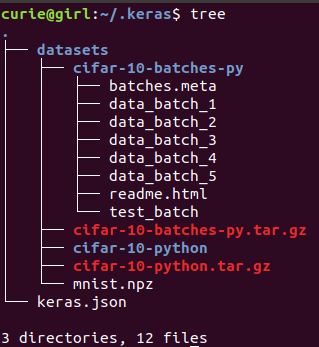

[TOC]
# M-Project 

Copyright (C) 2017 Frank Curie (邱日)

------------------------


# 开发环境

## VScode
- download : https://code.visualstudio.com/docs?start=true

- install :  

  ```shell
  sudo dpkg -i code_1.21.1-1521038896_amd64.deb code_1.21.1-1521038896_amd64.deb
  ```

- run: 

  - https://blog.csdn.net/FernChen/article/details/52259692

  - ```python
    #encoding:utf-8
    print "hello"
    ```

  - terminal: python hello.py

  - ctrl+B:

    ```javascript
    {
        // See https://go.microsoft.com/fwlink/?LinkId=733558
        // for the documentation about the tasks.json format
        "version": "2.0.0",
        "tasks": [
            {
                "label": "echo",
                "type": "shell",
                "command": "python",
                "args": [
                    "${file}"
                ],
                "group": {
                    "kind": "build",
                    "isDefault": true
                }
            }
        ]
    }
    ```

- theme (optional)

  - Extensions: One Dark Pro

- Extensions:

  - yapf :安装yapf之后在VScode中按Alt+Shift+F即可自动格式化代码


# 文档

- 中文文档　https://www.gitbook.com/book/wizardforcel/keras-cn/details　(download PDF)

- You can also get docs(zh) using **mkdocs**:

  - ```shell
    sudo apt-get install mkdocs
    git clone git://github.com/keras-team/keras-docs-zh
    cd keras-docs-zh
    mkdocs build
    # then you will get 'site' directory here,they are html pages.

    ```

  ​

# Anaconda

- ```shell
  sudo chmod 777 Anaconda2-4.3.0-Linux-x86_64.sh
  ./Anaconda2-4.3.0-Linux-x86_64.sh
  ```

- ```sh
  Anaconda2 will now be installed into this location:
  /home/curie/anaconda2

    - Press ENTER to confirm the location
    - Press CTRL-C to abort the installation
    - Or specify a different location below

  [/home/curie/anaconda2] >>> 
  PREFIX=/home/curie/anaconda2
  Do you wish the installer to prepend the Anaconda2 install location
  to PATH in your /home/curie/.bashrc ? [yes|no]
  [no] >>> yes
  Prepending PATH=/home/curie/anaconda2/bin to PATH in /home/curie/.bashrc
  A backup will be made to: /home/curie/.bashrc-anaconda2.bak
  For this change to become active, you have to open a new terminal.
  Thank you for installing Anaconda2!

  ```

- ```sh
  /home/curie/.bashrc
  # added by Anaconda2 4.3.0 installer
  export PATH="/home/curie/anaconda2/bin:$PATH"
  ```

- ```shell
  conda install tensorflow
  conda install keras
  ```

  - ​

    ```shell
    sudo conda install ipython
    ```

  - ```sh
    sudo apt-get install aptitude
    sudo aptitude install python-dev 
    ```
    ​

    ```
    Do you wish the installer to prepend the Anaconda3 install location
    to PATH in your /home/curie/.bashrc ? [yes|no]
    [no] >>> 
    You may wish to edit your .bashrc to prepend the Anaconda3 install location to PATH:

    export PATH=/home/curie/anaconda3/bin:$PATH

    Thank you for installing Anaconda3!

    ```

    ​


## lampp

- download: https://www.apachefriends.org/zh_cn/download.html 

- install:

  - ```shell
     sudo chmod 777 xampp-linux-x64-7.2.3-0-installer.run
     sudo ./xampp-linux-x64-7.2.3-0-installer.run
     #XAMPP will be installed to /opt/lampp
     ```
    ```

    ```

- [auto run](http://www.bubuko.com/infodetail-20974.html):

  - ```shell
    # 开机启动lampp
    sudo ln -s /opt/lampp/lampp  /etc/init.d/lampp
    sudo update-rc.d -f lampp defaults
    ```

- site:

  - ```
    sudo chmod 777 -R /opt/lampp/htdocs
    cd /opt/lampp/htdocs;mkdir Docs
    #然后可以把自己的站点放进Docs文件夹
    ```

## Keras Docs

- 下载整个网站

  - ```shell
    #递归下载整个网站
     wget -r https://keras.io
    ```

  - ​

- ​

## 例子学习

### Keras examples

#### cifar10_cnn.py

- 下载cifar10py数据集

- 显示隐藏文件到

  - ```
    出错信息
    [Errno 2] No such file or directory: '/home/curie/.keras/datasets/cifar-10-batches-py/data_batch_1'
    ```

  - ```
    cd .keras
    解压cifar-10-python.tar.gz
    tree
    ```

  - 

- ​


## 术语解释

- Pooling:([池化](https://zhidao.baidu.com/question/1834646938786477900.html))

  - ```
    pooling
    理论在于，图像中相邻位置的像素是相关的。对一幅图像每隔一行采样，得到的结果依然能看。
    经过一层卷积以后，输入的图像尺寸变化不大，只是缩小了卷积核-1。根据相邻数据的相关性，在每个nxn区域内，一般2x2，用一个数代表原来的4个数，这样能把数据缩小4倍，同时又不会损失太多信息。
    一副24*24的图像。用5*5卷积核卷积，结果是20*20（四周各-2），经过2*2池化，变成10*10.
    ```

## 学习资源

Here are some helpful resources.

- [food-101-keras](https://github.com/stratospark/food-101-keras)	  [blog address](http://blog.stratospark.com/deep-learning-applied-food-classification-deep-learning-keras.html)
- [Keras Blog](https://blog.keras.io/building-powerful-image-classification-models-using-very-little-data.html)
  - building powerful image classification models using very little data
- [Keras-Tutorials](http://nbviewer.jupyter.org/github/xingkongliang/Keras-Tutorials/blob/master/01.mnist_mpl.ipynb)
- [leaf classification](https://www.kaggle.com/c/leaf-classification/)
- [flower dataset](https://www.kaggle.com/alxmamaev/flowers-recognition)
  - https://www.kaggle.com/aakashnain/flowers-are-mesmerizing


## 附录

### [wget](https://www.linuxidc.com/Linux/2015-06/118256.htm)

使用wget下载一个单独的文件.

1. `# wget http://www.website-name.com/file`

递归下载整个网站.

1. `# wget -r http://www.website-name.com`

从一个网站下载指定类型的文件(例如 pdf 和 png).

1. `# wget -r -A png,pdf http://www.website-name.com`

Wget是一个很棒的工具，它允许在资源有限的机器上自定义或者过滤下载。这是镜像一个网站(Yahoo.com)的wget下载截图。

- ```shell
  wget -r http://cangls.com/
  ```

  ​

-------------------------------

### PlantUML

- VScode的一个插件,可以像是编程那样画UML图.


## Dataset

- cifar-10(python) 		[official](https://www.cs.toronto.edu/~kriz/cifar.html) 		[百度云](https://blog.csdn.net/baidu_35113561/article/details/79375701)
  - [教程](https://zhuanlan.zhihu.com/p/29214791) 如何用Keras从头开始训练一个在CIFAR10上准确率达到89%的模型

##  

## 参考文献

- https://www.kaggle.com/gaborfodor/keras-pretrained-models

------------------------------------

# 问题解决

## pip

### pip目录的属主不是sudo的root用户

- http://blog.sina.com.cn/s/blog_a046022d0102w2ux.html

- ```shell
  sudo chown root /home/curie/.cache/pip
  sudo chown root /home/curie/.cache/http
  ```


### 安装好keras后但发现没有

- 用pip3安装后都安装到了/usr/local/lib/python3.6/dist-packages里了 [路径问题](https://blog.csdn.net/tsinghuahui/article/details/76223354)

- 问题是pip向系统自带的python安装而不向anaconda安装

  - ```
    ubuntu直接安装anaconda是不能直接使用pip 的，因为pip install需要sudo权限，而sudo pip是系统自带的python的pip 
    这两个是不一样的
    ```

  - https://blog.csdn.net/zl87758539/article/details/73823641

- 权限不够

  An error occurred while uninstalling package 'defaults::conda-4.4.10-py36_0'.

  - ```shell
    sudo chown -R curie:curie /home/curie/anaconda3
    #再删去系统中除了anaconda3之外的conda,只留这个anaconda3里面的conda
    ```

## Anaconda 2 & Anaconda 3

[Anaconda 2 and Anaconda 3](https://blog.csdn.net/qq_33039859/article/details/79213392) 

**已经安装好Anaconda2的条件下安装Anaconda3** 
`conda create -n py35 python=3.5 anaconda` 
运行环境切换： 
进入py35环境 `source activate py35` 
退回py27环境 `source deactivate py35`

**已经安装好Anaconda3的条件下安装Anaconda2** 
`conda create -n py27 python=2.7 anaconda` 
进入py27环境 `source activate py27` 
退回py35环境 `source deactivate py27`


## 问题解决日志

### 2018.3.23

因为重装系统,环境需要重装,但遇到问题,解决如下.

- 系统的pip和anaconda里的pip还不是一个,用sudo pip 安装到了系统python下,因此应当conda install

- conda 又遇到问题,在于conda也不止一个,whereis conda,删去系统里的conda,只留anaconda里的conda

- 这样conda只剩一个,然而又遇到权限问题

  - ```
    #遇到的错误:
    ERROR conda.core.link:_execute(481): An error occurred while uninstalling package 'defaults::conda-4.4.10-py36_0'.
    ```

  - ```shell
    ##先解决权限问题
    sudo chown -R curie:curie /home/curie/anaconda3
    ##再更新conda
    conda update -n base conda
    conda install keras
    ```


